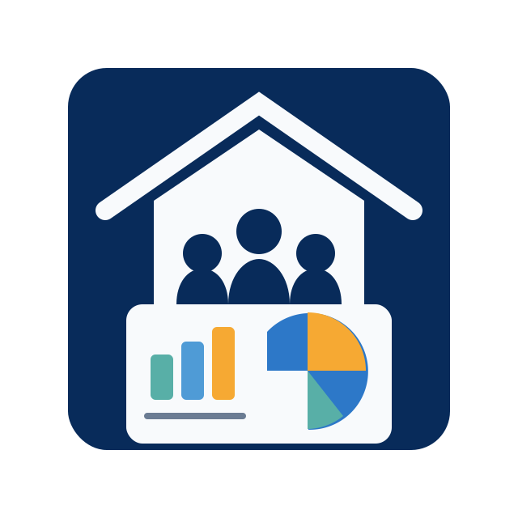

# United Caring Dashboard



United Caring Dashboard is a Django-based web application for tracking shelter operations, occupancy, white-flag conditions, and reporting in one shared interface for administrators and staff.

## Live Demo

Try the deployed app here:

➡️ **https://united-caring-dashboard.onrender.com/**

## How it Operates

The project is organized as a multi-app Django system:

- **`mainscreen`**: Provides the main landing workflow.
- **`accounts`**: Handles user account-related views/models.
- **`dashboard`**: Displays central dashboard views and metrics.
- **`shelters`**: Manages shelter-related data and forms.
- **`whiteflag`**: Handles white-flag status workflows and pages.
- **`reports`**: Provides report-oriented views and data models.
- **`admin_panel`**: Contains custom admin login/pages and related routes.

At runtime, requests are routed through Django URL configurations (`shelter_system/urls.py` and app-level `urls.py` files), rendered with shared templates in `templates/`, and backed by app models/migrations.

## Local Development

1. Install dependencies:

   ```bash
   pip install -r requirements.txt
   ```

2. Run migrations:

   ```bash
   python manage.py migrate
   ```

3. Start the development server:

   ```bash
   python manage.py runserver
   ```

4. Open:

   ```
   http://127.0.0.1:8000/
   ```

## Tech Stack

- Python
- Django
- HTML templates
- SQLite (default Django local DB)
